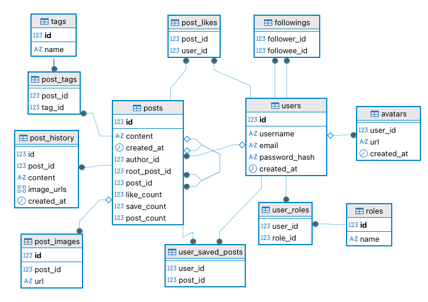

### Local dev

1. Install postgresql 17
2. Install [Extension Pack for Java](https://marketplace.visualstudio.com/items?itemName=vscjava.vscode-java-pack)
3. Run vscode debug
4. Open(http://localhost:8080)in your browser showing swagger doc

### Database design

### Features

- Account
- Avatar
- Role-based access control
- Updating account info
- Bcrypt password encrypting
- Create post
- Like/unlike for posts
- Save/unsave posts
- Create child posts
- Follow/unfollow other users
- Post hashtags
- Search posts by content
- Sort posts by like/save/child posts count in ascending and descending order
- Images in post
- Post history
- Activities
